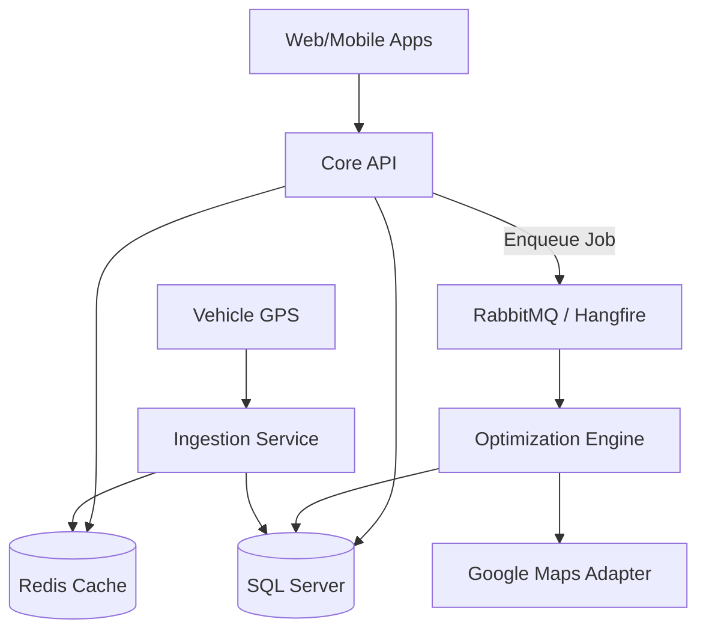

# Real-Time Personnel Shuttle Application Architecture Proposal

> [!IMPORTANT]
> **Role**: Senior Backend Architect
> **Context Level**: 7 (Enterprise, Scalable, Cost-Optimized)
> **Goal**: Design a RouteWix-like optimization engine.

## 1. System Architecture (High-Level)

We will adopt a **Modular Monolith** approach (migratable to Microservices) using **Onion Architecture**.

### Core Components
1.  **Optimization Engine (Worker)**: Dedicated background service for heavy VRP (Vehicle Routing Problem) calculations.
2.  **Real-Time Ingestion Service**: High-throughput service for processing GPS streams (gRPC/SignalR).
3.  **Notification Service**: Push notifications and Alerts.

### Diagram


---

## 2. Domain Models (Entities)

### Personnel Context
```csharp
class Personnel {
    Guid Id;
    Location HomeLocation; // Lat/Lon
    Shift Shift;
    Guid? AssignedRouteId;
    List<Constraint> SpecialNeeds; // e.g., "Front seat", "Elevator access"
}
```

### Fleet Context
```csharp
class Vehicle {
    Guid Id;
    int Capacity;
    Location DepotLocation;
    VehicleType Type; // Bus, Minivan
    double CostPerKm;
}
```

### Route Context
```csharp
class Route {
    Guid Id;
    Guid VehicleId;
    List<RouteStop> Stops;
    DateTime StartTime;
    DateTime EndTime;
    double TotalDistanceMeters;
    double ExpectedDurationSeconds;
    RouteStatus Status; // Planning, Active, Completed
}

class RouteStop {
    int Order;
    Location Location;
    List<Guid> PickupPersonnelIds;
    DateTime EstimatedArrival;
}
```

---

## 3. Google Maps Integration & Cost Optimization Strategy

Google Maps APIs are expensive ($5-10 per 1000 elements). We must minimize calls.

### Strategy: "Filter, Cluster, Then Query"
1.  **Geocoding (On Import)**: Convert addresses to Lat/Lon *once* and store them.
2.  **Stage 1: Haversine Filtering (Free)**:
    -   Use simple geometry (Haversine formula) to calculate line-of-sight distances.
    -   Filter out vehicles/stops that are obviously too far to be candidates.
    -   *Cost*: $0.
3.  **Stage 2: Clustering (K-Means / DBSCAN)**:
    -   Group personnel geographically using Lat/Lon.
    -   Create "Virtual Bus Stops" (centroids) to reduce the number of nodes in the matrix.
    -   *Cost*: $0 (Computational only).
4.  **Stage 3: Distance Matrix API (Sparse Matrix)**:
    -   Query actual travel times **only** for:
        -   Centroid ↔ Centroid
        -   Centroid ↔ Depot
    -   **Cache Strategy**: Store `Origin_Destination` hash in Redis with a 30-day TTL.
5.  **Stage 4: Directions API**:
    -   Call **once** per finalized route to get the polyline for the map.
    -   **Never** call Directions API during the optimization iterations.

---

## 4. Optimization Algorithm (VRP Solver)

We need to solve the **Capacitated Vehicle Routing Problem with Time Windows (CVRPTW)**.

### Pipeline
1.  **Input Parsing**:
    -   Fetch Active Personnel for the target Shift.
    -   Fetch Available Vehicles.
2.  **Constraint Propagation**:
    -   Filter vehicles by Region/Zone.
    -   Exclude personnel on leave.
3.  **Clustering (Heuristic)**:
    -   Algorithm: **DBSCAN** (Density-Based Spatial Clustering).
    -   Group personnel who can walk to a standard pickup point (e.g., within 500m).
4.  **Routing (Meta-Heuristic)**:
    -   Use **Google OR-Tools** or **Genetic Algorithms**.
    -   *Objective Function*: Minimize `(TotalDistance * CostWeight) + (TotalDuration * TimeWeight)`.
    -   *Penalty*: Late arrival, exceeding capacity.
5.  **Post-Optimization**:
    -   Smooth the path using 2-opt or 3-opt exchanges for local optimality.

---

## 5. Background Worker & Integration

Optimization is CPU intensive. **Do not run it in the HTTP Request thread.**

### Flow
1.  **User**: Uploads Excel -> API saves to Staging Table -> Returns `JobId`.
2.  **API**: Publishes `OptimizeRouteCommand` (MassTransit/RabbitMQ).
3.  **Worker**: 
    -   Consumes command.
    -   Loads data.
    -   Runs Algorithm (Sections 3 & 4).
    -   Saves `ProposedRoute` entities.
    -   updates `JobStatus = Completed`.
4.  **User UI**: Polls `JobStatus` or receives SignalR notification.

---

## 6. Live Tracking & Edge Cases

### Real-Time Tracking
-   **Mobile App**: Driver app sends GPS every 10s.
-   **Ingestion**:
    -   Update `Redis` Key: `vehicle:geo:{id}`.
    -   Calculate `EstimatedArrival` for next stops using previous segment speed.
    -   **Alert**: If `ActualLatLon` deviates > 500m from `RoutePolyline`, trigger "Route Deviation Alert".

### Edge Cases
1.  **Traffic Jam**:
    -   Worker periodically re-checks `TrafficModel=best_guess` vs current time.
    -   If delay > 15 mins, send push notification to remaining personnel.
2.  **Capacity Overflow**:
    -   Algorithm leaves ~10% buffer in capacity (e.g., 25-seater plans for 23 pax).
3.  **Isolated Personnel**:
    -   If a person is > 10km from any cluster, flag as "Outlier".
    -   Suggest: "Taxi" or "Special Route".

---

## 7. Technology Stack Recommendation

-   **Backend**: .NET 10 (C#)
-   **Messaging**: MassTransit (RabbitMQ)
-   **Data**: SQL Server (with Spatial types for geo-queries)
-   **Cache**: Redis (StackExchange.Redis)
-   **Maps**: Google Maps Platform (optimized)
-   **Solver**: Google OR-Tools (via C# wrapper)
